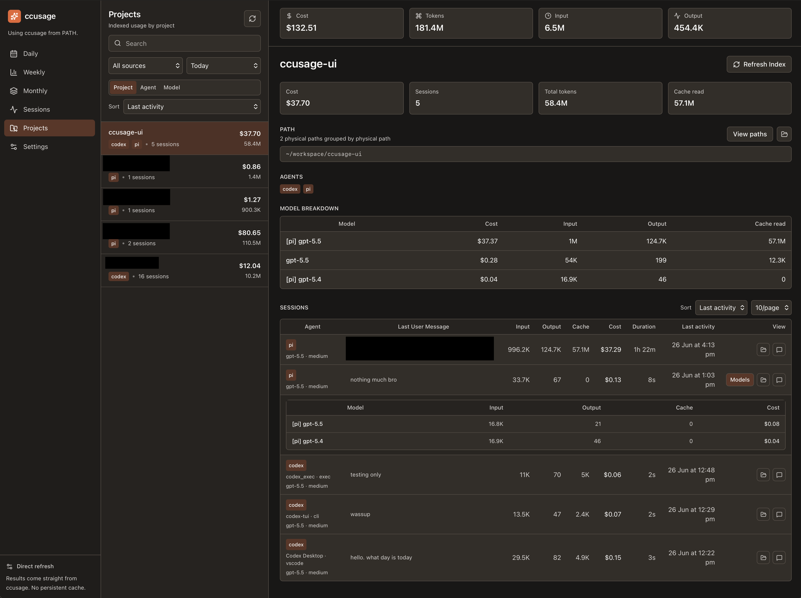
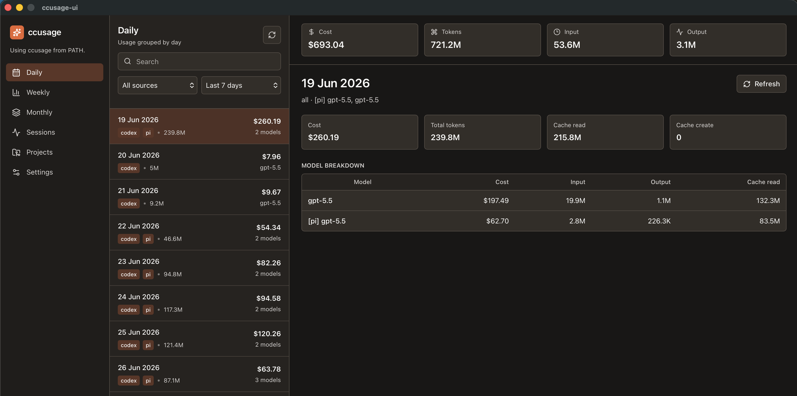

# ccusage-ui

A Wails desktop GUI for [`ccusage`](https://github.com/ccusage/ccusage).

The app shows ccusage reports, indexes sessions locally for project views, supports configurable project grouping, and can display formatted session conversations from local transcripts.

## Screenshots

### Projects



### Daily report



## Requirements

- Go, matching `go.mod`
- Bun
- Wails CLI
- A ccusage runner. The app detects one in this order:
  1. `ccusage` on `PATH`
  2. `bunx ccusage`
  3. `nix run github:ccusage/ccusage --`
  4. `npx ccusage@latest`
  5. `pnpm dlx ccusage`

Recommended local setup:

```bash
mise install
bun install --cwd frontend
go install github.com/wailsapp/wails/v2/cmd/wails@latest
bun install -g ccusage
```

If you do not install `ccusage` globally, the app can still fall back to `bunx`, `nix`, `npx`, or `pnpm` when available.

## Development

```bash
make dev
```

This starts Wails dev mode and Vite HMR for frontend changes.

## Build and run locally

```bash
make run
```

This builds the Wails app and opens the generated macOS app bundle.

To only build:

```bash
make build
```

or:

```bash
wails build
```

## Tests

```bash
go test ./...
cd frontend && npm run build
```

## GitHub Actions macOS build

A manual workflow is available under **Actions → macOS Build**. It builds a macOS `.app`, packages it as a zip, and uploads it as a workflow artifact.

The current artifact is unsigned/not notarized, so macOS Gatekeeper may require right-click → Open or local signing for distribution.
